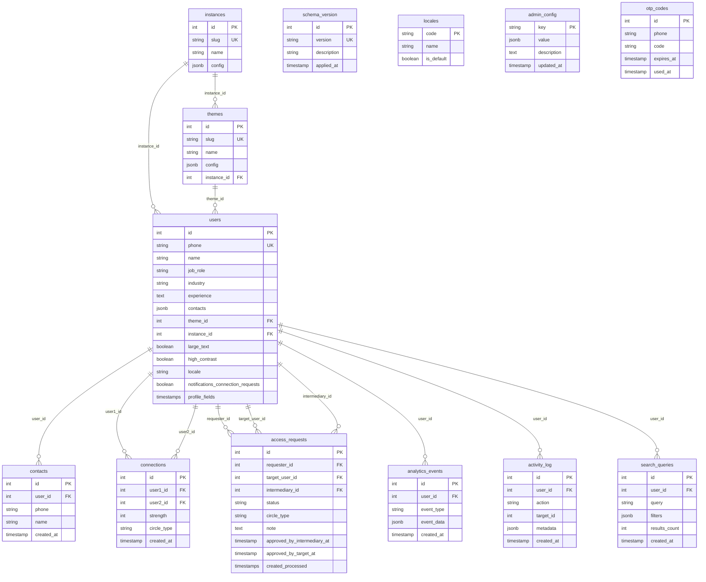

# Trust Network — product overview (current codebase)

Copy-paste–ready description of what the application does today, plus an entity-relationship diagram of the persisted data model.

---

## What Trust Network does (current codebase)

**Trust Network** is a professional networking web application built with a **React 18 (Create React App)** frontend, **Node.js / Express** API, and **PostgreSQL**. It is typically run via **Docker Compose** (nginx-served frontend, API container, Postgres).

### Identity and access

- Users are identified by a **unique phone number** (normalized to E.164 with `libphonenumber-js`).
- **Login**: `POST /api/auth/identify` looks up the user by phone. Whether an **OTP** is required is controlled by **`admin_config.require_phone_verification`** (toggleable from an **Admin** screen). When OTP is on, Twilio can send SMS; when off, identify can return a **JWT** immediately for testing.
- **`POST /api/auth/verify`** completes OTP; **`POST /api/auth/register`** creates a new user.
- Authenticated routes use **Bearer JWT**; middleware rejects mismatched `user_id` in body/query vs token.

### Core product concept: two circles

- **`connections`** rows link two users with **`circle_type`**: **`inner`** (first circle) or **`secondary`** (second circle). Pairs are stored with **`user1_id < user2_id`** and a **`strength`** score (maintained by DB logic: shared inner peers and account age).
- Users see their own edges under **row-level security** (`app.user_id`); cross-user flows (e.g. proving an intermediary sits between requester and target, or listing another user’s inner peers for secondary discovery) use **narrow `SECURITY DEFINER` SQL functions** (`app_can_intermediate`, `app_finalize_secondary`, `app_secondary_for`, etc.) so authorization stays in the database.

### Contacts

- **`contacts`** stores each user’s **imported address-book rows** (`user_id`, `phone`, `name`), matched to **registered `users`** by phone for in-app actions.

### Introductions / requests

- **`access_requests`** model **connection requests**: **requester**, **target**, optional **intermediary**, **`circle_type`** (`inner` or `secondary`), **status** (`pending`, `accepted`, `declined`, etc.), **dual-approval timestamps** for secondary (`approved_by_intermediary_at`, `approved_by_target_at`).
- API: create request, list pending (for target/intermediary), **respond** with `accept` / `decline` / `approve_as_intermediary` / `approve_as_target`. Inner requests can finalize with a direct accept; secondary requests require **both** approvals, then a **`secondary`** `connections` row is created via the definer function.

### Profile and UX

- **`GET/PATCH /api/profile`** for the signed-in user’s professional fields (name, job role, industry, experience) and prefs.
- **`themes`** (and user **`theme_id`**, **`locale`**, accessibility flags) drive theming; **`GET /api/themes`** is public.

### Admin

- **`admin_config`** key/value (JSONB) for feature flags (notably phone verification). Admin routes are gated (e.g. admin user IDs / phones from env).
- **`otp_codes`** stores short-lived codes when OTP is enabled.

### Analytics / activity (data layer vs UI)

- Tables **`analytics_events`**, **`activity_log`**, and **`search_queries`** exist for logging; the **Activity** page in the frontend is still largely **placeholder** copy, not wired to those tables.

### Multi-tenancy (planned)

- **`instances`** and **`users.instance_id`** / **`themes.instance_id`** support future white-label deployments; not required for single-tenant use.

### Frontend routes (after login)

- Dashboard, Connections (radial / request handling), Contacts (import, secondary discovery via inner peer, requests), Activity (placeholder), Settings (profile + prefs), Admin (toggles).

---

## Entity-relationship diagram

Logical ERD of main persisted entities. Some columns are abbreviated; see `database/schema.sql` and `database/migrations/` for full detail.

### Diagram notes

- **`connections`** is a single table with **two FKs** to `users`; the app enforces **`user1_id < user2_id`**.
- **`access_requests`** has **up to three** user FKs (requester, target, intermediary); intermediary is null for pure inner requests.
- **`schema_version`** and **`locales`** are infrastructure/support tables, not business “actors.”
